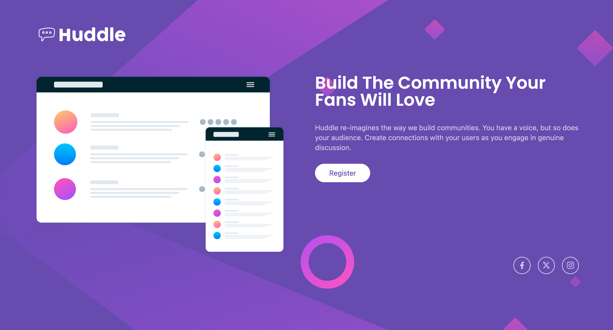

# Frontend Mentor - Huddle landing page with single introductory section solution

This is MrJay's solution to the [Huddle landing page with single introductory section challenge on Frontend Mentor](https://www.frontendmentor.io/challenges/huddle-landing-page-with-a-single-introductory-section-B_2Wvxgi0). 

## Table of contents

- [Overview](#overview)
  - [The challenge](#the-challenge)
  - [Screenshot](#screenshot)
  - [Links](#links)
- [My process](#my-process)
  - [Built with](#built-with)
  - [Continued development](#continued-development)
- [Author](#author)

## Overview

### The challenge

Users should be able to:

- View the optimal layout for the page depending on their device's screen size
- See hover states for all interactive elements on the page

### Screenshot



### Links

- Solution URL: [Github](https://github.com/jeresulovuo/huddle-landing-page)
- Live Site URL: [Vercel](https://mrjays-huddle-landing-page.vercel.app/)

## My process
I first analyse the layout and structure for mobile view first and then desktop.
I would build these in three sections:
- Header with logo
- Body
  - in desktop, it will be flex-row. Both rows will be 50% 50%.
  - In mobile, it will be flex-col.
- Social Media

For the states:
- the button in the body turn to Soft-magneta.
- the social media buttons turns to Soft-magneta.

### Built with

- Semantic HTML5 markup
- TailwindCSS
- Flexbox
- Mobile-first workflow

### What I learned

I am using this landing page as an opportunity to apply TailwindCSS via CDN. Also makeing custom tailwind properties via CDN.

```
    <script src="https://cdn.tailwindcss.com"></script>
    <script>
        tailwind.config = {
            theme: {
                    extend: {
                        fontFamily: {
                          Poppins: ['Poppins', 'sans-serif'],
                          'Open-sans': ['Open Sans', 'sans-serif']
                        },
                        colors: {
                            Violet: 'hsl(257, 40%, 49%)',
                            'Soft-Magenta': 'hsl(300, 69%, 71%)'
                        }
                    }
            }
        }
    </script>
```

### Continued development

This landing page will be later visited which more pages will be applied to this landing page. Plus adding a laptop view.

## Author

- Website - [MrJay's Simple Portfolio](https://mrjays-simple-portfolio.vercel.app/)
- Github - [Jere/ Chung Vui Loong](https://github.com/chungvuiloong)
